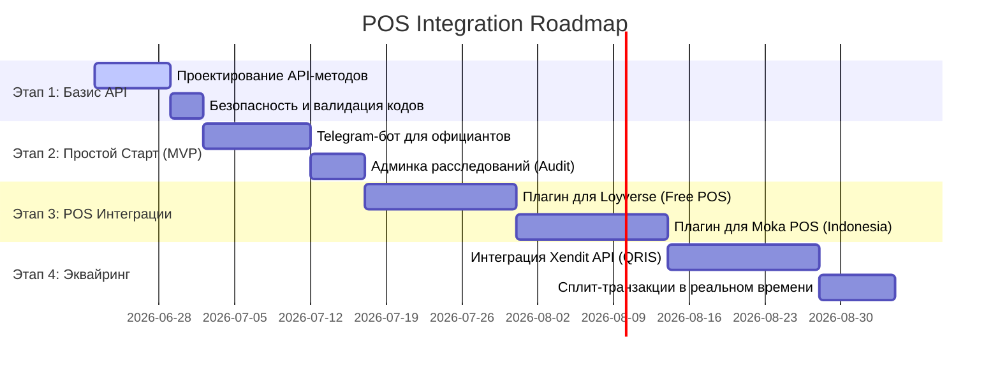

# 🗺️ Global Roadmap: POS-Integration & Transaction Automation

Дорожная карта перехода платформы **Agent Core** от ручного подтверждения к полной автоматизации через интеграцию с кассовыми аппаратами (POS-системами) заведений и сквозной аналитикой.

---

## 📍 Архитектурная концепция
Вся логика строится вокруг **одноразовых кодов сессий (4 или 6 цифр)**. Когда промоутер берёт заказ (оффер) в мобильном приложении, генерируется сессия, связывающая:
`Агент (Промоутер) ➔ Заведение (Оффер) ➔ Одноразовый код (4-6 цифр)`

При оплате этот код считывается кассой (POS) или вводится вручную. Система автоматически рассчитывает скидку, выплату агенту и комиссию платформы.

---

## 🚀 Этапы интеграции

### Этап 1. Архитектурный базис (Подготовка API)
* **Цель:** Создать единую точку доступа (API) для кассовых аппаратов.
* **Задачи:**
  - Разработать эндпоинт `GET /api/v1/referrals/verify?code=XXXX` — касса мгновенно запрашивает статус кода и получает параметры скидки (фиксированная или процент).
  - Разработать эндпоинт `POST /api/v1/referrals/complete` — касса отправляет итоговую сумму чека, закрывая сессию и распределяя средства.
  - Сделать генерацию кодов безопасной: 4-6 цифр с ограниченным сроком жизни (например, 24 часа) для исключения перебора кодов.

### Этап 2. Быстрый старт: Telegram-бот и Админка Аудита (MVP)
* **Цель:** Дать заведениям возможность работать без глубокого программирования в кассах, а администратору — инструмент контроля.
* **Задачи:**
  - **Telegram-бот для официантов:** Официант просто сканирует камерой телефона QR-код клиента в чат с ботом (или пишет код текстом). Бот моментально отправляет запрос к API Agent Core и применяет скидку.
  - **Панель Расследований (Audit Admin):** Строка поиска в админ-панели (`/admin`). Администратор вбивает любой код или транзакцию и видит:
    - Личность промоутера (профиль, статистика).
    - Заведение (название, координаты на интерактивной карте, где был взят оффер).
    - Дата, точное время и статус проведения оплаты.

### Этап 3. Интеграция с ключевыми POS-системами (Масштабирование на Бали)
* **Цель:** Внедрение непосредственно в программное обеспечение кассовых терминалов.
* **Задачи:**
  - **Loyverse Integration (Очень популярна на Бали):**
    - Использование Loyverse Open API.
    - Разработка вебхука: при создании чека в Loyverse кассир выбирает способ скидки "Agent Core", сканирует QR-код клиента, и Loyverse автоматически применяет скидку в чек на основе нашего API.
  - **Moka POS Integration (Основная касса в Индонезии):**
    - Разработка приложения для Moka App Directory.
    - Интеграция виджета Agent Core прямо на экран оплаты терминала Moka.

### Этап 4. Финансовый сплит-эквайринг (QRIS & Xendit)
* **Цель:** Автоматизировать движение реальных денег и исключить ручные взаиморасчеты.
* **Задачи:**
  - Интеграция с платежным шлюзом **Xendit** (главный индонезийский шлюз).
  - При закрытии стола POS генерирует динамический QRIS-код на оплату.
  - Когда клиент оплачивает QRIS через свой банковский апп, Xendit автоматически делит платеж:
    - Доля заведения уходит заведению.
    - Награда промоутеру начисляется на кошелек агента.
    - Наша комиссия платформы уходит на счет Agent Core.

---

## 🔒 Безопасность и защита от мошенничества
1. **Одноразовость кодов:** Как только код один раз проведен через POS или Telegram-бота, он мгновенно сгорает. Повторное использование невозможно.
2. **Гео-валидация:** Если код сканируется в POS-системе, физически находящейся в Убуде, а промоутер создал сессию для заведения в Семиньяке — транзакция блокируется, а администратору отправляется сигнал о подозрении на фрод.
3. **Лимиты резервного баланса (Reserve Protection):** Заведение не может выдать скидок на сумму, превышающую их текущий баланс резерва на нашей платформе (система предоплаты).
